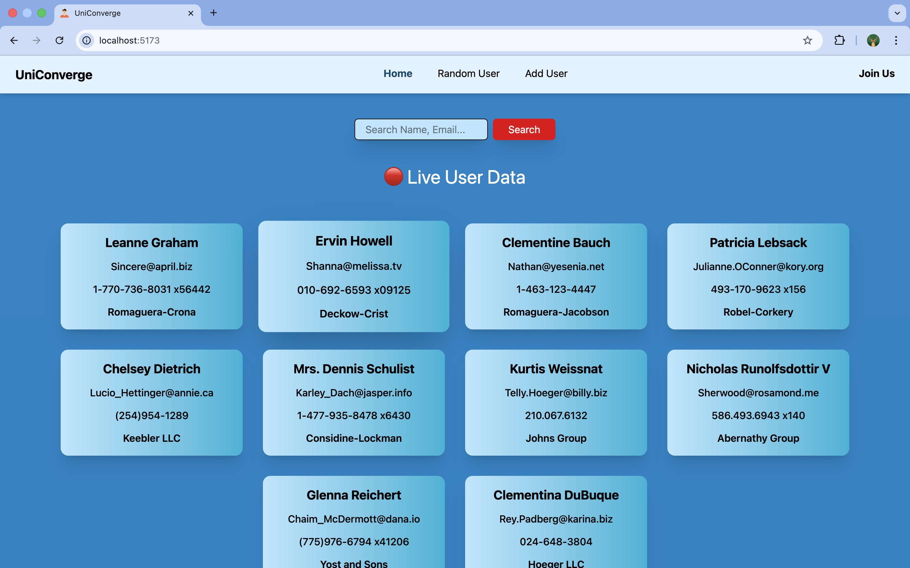
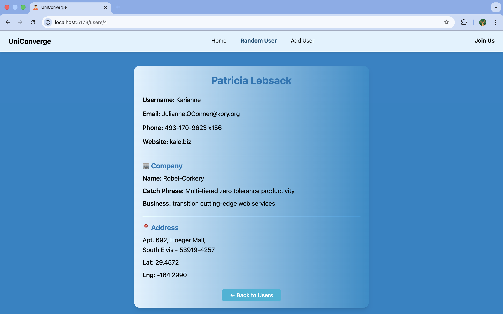
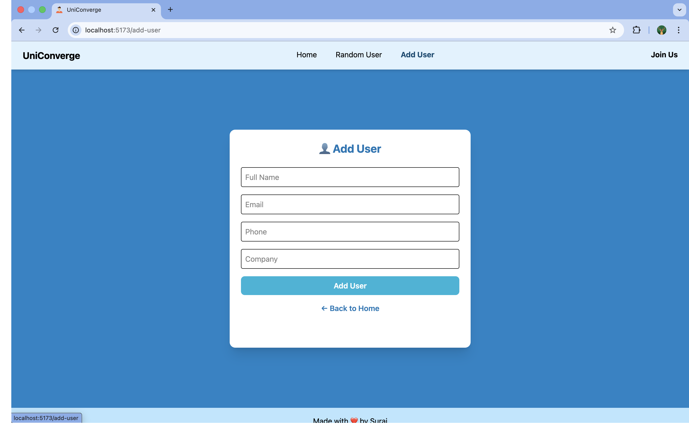
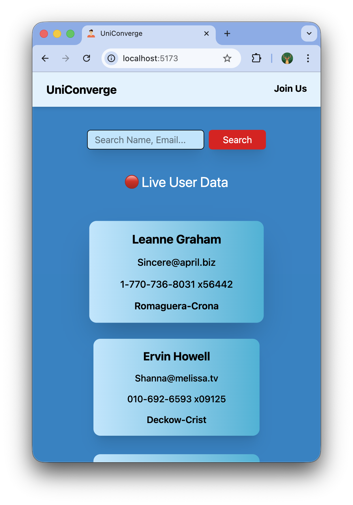

# 🌟 UniConverge Assignment


A clean and minimal implementation of the **UniConverge assignment**, built with a focus on clarity, speed, and reviewer-friendly code using **React + Vite** and **Tailwind CSS**.

---

## 🎨 Screenshots  
### 🏠 Home Page




### 📱 Responsive View


---

## ⚙️ Tech Stack

- **React (Vite)**
- **Tailwind CSS**
- Clean UI & reusable components  
- Minimal, easy-to-review layout

---

## 🚀 Getting Started

```bash
npm install
npm run dev
``` 

## 🔗 Local Development URL

```bash
http://localhost:5173/
``` 


---

## 💬 Notes

Kept the project lightweight and readable.
Happy to extend or refine the project if needed.

